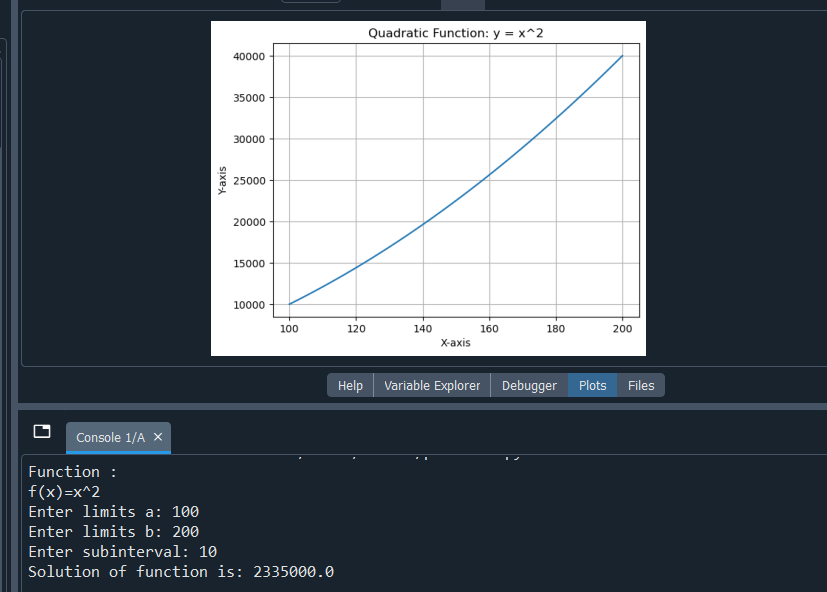

# Integration using Calculus & Graph Plotting

## Overview
This project performs numerical integration using the Trapezoidal Rule and visualizes the function using graphs.

---

## Features
- Takes input values (a, b, n)
- Computes integration using Trapezoidal Rule
- Plots graph of function y = x^2
- Displays area approximation

---

## Technologies
- Python
- NumPy
- Matplotlib

---

## How to Run
```bash
python main.py
```
## Output

